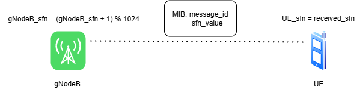
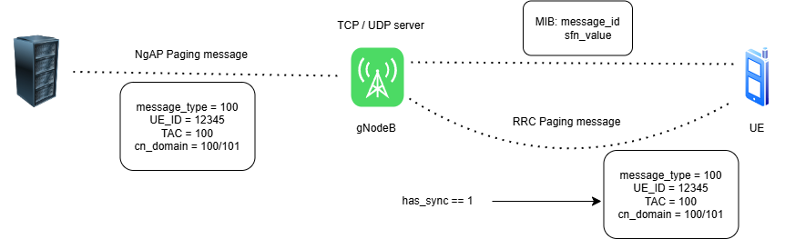
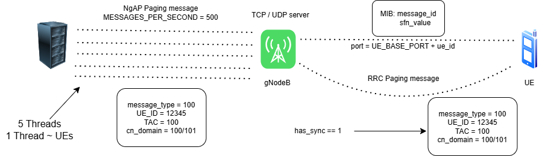

# Thủ Tục Paging Trong 5G NR – Báo Cáo Lab

## Lab 1: Mô phỏng đồng bộ khung thời gian SFN giữa UE và gNodeB

### 1. Đề bài
Viết chương trình mô phỏng quá trình đồng bộ khung thời gian SFN giữa UE và gNodeB bằng ngôn ngữ C, sử dụng giao tiếp qua giao thức UDP.

### 2. Mục tiêu
- Hiểu được cơ chế đồng bộ khung thời gian SFN trong 5G NR.
- Làm quen với mô phỏng UE và gNodeB bằng lập trình socket trong C.

### 3. Yêu cầu kỹ thuật
- Hai tiến trình: `UE.c` và `gNodeB.c` giao tiếp bằng UDP socket.
- Biến đếm thời gian SFN (`UE_sfn`, `gNodeB_sfn`) có giá trị trong khoảng [0, 1023].
- Cứ mỗi 10ms, cả hai biến tăng 1 đơn vị.
- Cứ mỗi 80ms, gNodeB gửi bản tin MIB (gồm `message_id = 1`, `sfn_value`) cho UE.
- UE cập nhật `UE_sfn` như sau:
  - Nếu **chưa đồng bộ**: cập nhật sau mỗi 80ms.
  - Nếu **đã đồng bộ**: cập nhật sau mỗi 800ms.

### 4. Mô tả chương trình



#### gNodeB.c
- Mỗi 10ms tăng `gNodeB_sfn` và đếm thời gian.
- Cứ 80ms, gửi bản tin MIB đến UE (qua UDP port 8888) chứa:

```bash
    buffer[0] = message_id (1 byte)
    buffer[1] = MSB của sfn_value (1 byte)
    buffer[2] = LSB của sfn_value (1 byte)
```


#### UE.c
- Mỗi 10ms tăng `UE_sfn`.
- Nhận bản tin từ gNodeB và xử lý:
- Nếu chưa đồng bộ → đồng bộ ngay.
- Nếu đã đồng bộ → đồng bộ lại sau mỗi 800ms.

### 5. Kết quả
Chương trình hoạt động đúng yêu cầu, mô phỏng thành công quá trình đồng bộ SFN giữa UE và gNodeB.

---

## Lab 2: Mô phỏng thủ tục Paging (mức tính năng)

### 1. Đề bài
Viết chương trình mô phỏng thủ tục Paging giữa 3 tiến trình: UE, gNodeB và AMF, sử dụng ngôn ngữ C.

### 2. Mục tiêu
- Nắm được luồng thủ tục Paging trong mạng 5G NR.
- Làm quen với giao tiếp TCP (AMF ↔ gNodeB) và UDP (gNodeB ↔ UE).

### 3. Kiến trúc hệ thống
- **AMF** giao tiếp với gNodeB qua **TCP socket (port 6000)**.
- **gNodeB** giao tiếp với UE qua **UDP socket (port 5000)**.
- **gNodeB** đồng bộ SFN với UE qua UDP (port 8888).

### 4. Mô tả từng tiến trình



#### AMF.c
- Kết nối TCP tới `gNodeB` tại `127.0.0.1:6000`.
- Tạo bản tin Paging (`int message[4]`):
- `message_type = 100`
- `UE_ID = 12345`
- `TAC = 100`
- `cn_domain = 100` (VoLTE) hoặc `101` (Data)
- Gửi bản tin đến gNodeB.

#### gNodeB.c
Chia thành 3 luồng chính:
1. **TCP Server Thread**
 - Nhận bản tin Paging từ AMF.
 - Lưu vào hàng đợi (`queue`) để xử lý sau.
2. **SFN Thread**
 - Mỗi 10ms tăng `gNodeB_sfn`.
 - Cứ 80ms gửi bản tin MIB cho UE để đồng bộ.
3. **Paging Thread**
 - Mỗi 5ms kiểm tra hàng đợi.
 - Nếu đã đồng bộ (`has_sync == 1`) → gửi bản tin Paging cho UE qua UDP.

#### UE.c
Gồm 2 luồng:
1. **SFN Sync Thread**
 - Nhận bản tin MIB từ gNodeB qua port 8888.
 - Tự động cập nhật `UE_sfn` theo điều kiện đồng bộ.
2. **Paging Receiver Thread**
 - Nhận bản tin Paging từ gNodeB qua port 5000.
 - Phân loại bản tin Paging (VoLTE hoặc Data) và in ra màn hình.

### 5. Kết quả
Mô phỏng đúng luồng hoạt động của thủ tục Paging ở mức tính năng, với khả năng đồng bộ và xử lý bản tin Paging giữa AMF → gNodeB → UE.

---

## Lab 3: Mô phỏng thủ tục Paging (mức hiệu năng)

### 1. Đề bài
Viết chương trình mô phỏng thủ tục Paging có thể xử lý **400–500 bản tin/giây**, cho các UE khác nhau.

### 2. Mục tiêu
- Thiết kế gNodeB có khả năng xử lý lưu lượng lớn bản tin Paging từ AMF.
- Tối ưu sử dụng đa luồng và hàng đợi.

### 3. Thiết kế tổng thể



#### AMF.c
- Nhận số lượng UE từ người dùng.
- Dùng `NUM_THREADS = 5` để gửi `MESSAGES_PER_SECOND = 500` bản tin mỗi giây.
- Xen kẽ bản tin VoLTE và Data.
- Mỗi thread gửi bản tin dạng:

```bash
    int message[4] = {message_type, ue_id, tac, cn_domain};
```


#### gNodeB.c
- Quản lý hàng đợi bản tin Paging (`message_queue`).
- Gồm các thành phần:
1. **SFN Thread**
   - Mỗi 10ms tăng `current_sfn`.
   - Broadcast SFN tới toàn bộ UE.
2. **RRC Sender Thread**
   - Nếu đã đồng bộ (`is_sync = 1`), gửi bản tin đến UE.
3. **TCP Connection Handler**
   - Nhận bản tin từ AMF.
   - Đóng gói vào hàng đợi.
   - Ghi log IP AMF và số bản tin nhận được.

#### UE.c
- Mỗi UE có một cổng UDP riêng (`port = UE_BASE_PORT + ue_id`).
- Gồm:
1. **SFN Synchronizer**
   - Giao tiếp UDP với gNodeB để đồng bộ `UE_sfn`.
2. **UE Thread**
   - Mỗi UE xử lý bản tin riêng, in ra loại bản tin khi nhận.

### 4. Kết quả
- Chương trình hoạt động ổn định ở tốc độ **500 bản tin/s**, xử lý song song nhiều kết nối và nhiều UE.
- Đáp ứng yêu cầu mô phỏng thủ tục Paging ở mức hiệu năng cao.

---

## Tổng kết

Qua 3 bài Lab, chương trình đã từng bước:
- Mô phỏng thành công đồng bộ thời gian SFN giữa UE và gNodeB.
- Mô phỏng thủ tục Paging giữa AMF, gNodeB, UE ở mức tính năng và mức hiệu năng.
- Ứng dụng đa luồng, socket TCP/UDP, hàng đợi bản tin và kỹ thuật đồng bộ thời gian.
- Thể hiện sự hiểu biết về kiến trúc mạng 5G NR cũng như khả năng lập trình hệ thống mô phỏng đơn giản trong C.
